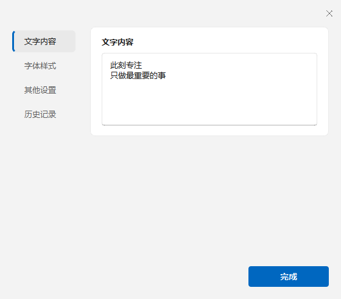
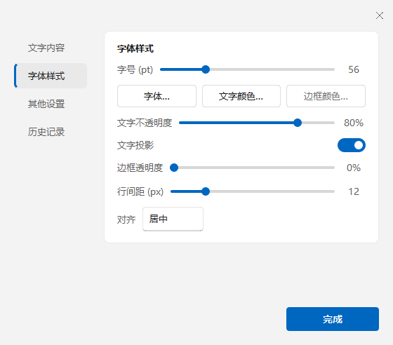
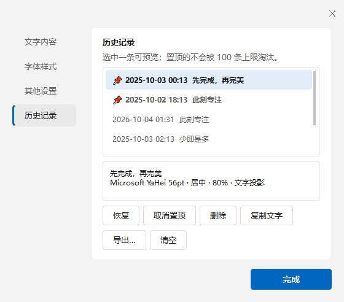
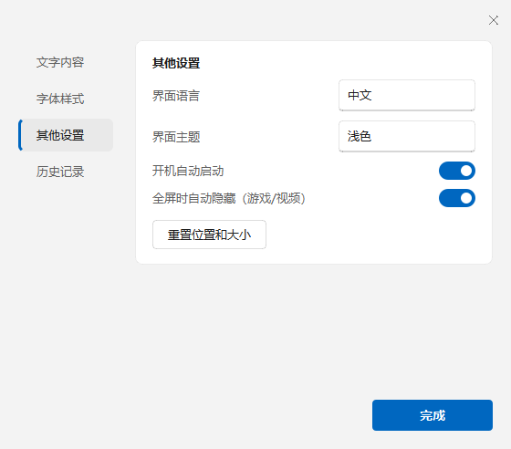
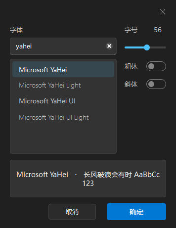
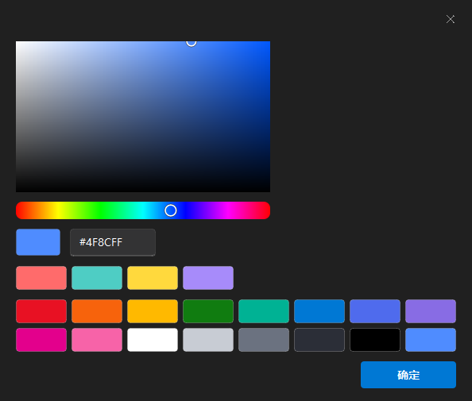
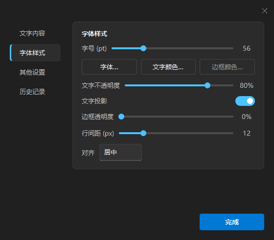

# 念 ToMe

**在桌面上放一段只属于自己的话。**

文字贴在壁纸层之上、所有窗口之下，鼠标点击穿透，不挡任何操作。想改的时候，托盘右键就行。

<sub>Windows 10 19041+ / Windows 11 · MIT License · 免费 · 不联网</sub>

### ⬇ [下载最新版](https://github.com/Entropy2025/ToMe/releases/latest)


---

## 它是什么

一个常驻桌面的小挂件，只做一件事：把你此刻想看到的那句话，安静地放在桌面上。

不弹窗、不提醒、不联网、不占任务栏。你看得见它，但它不挡你——鼠标直接穿过文字，点到下面的图标。

## 界面

### 文字内容



### 字体样式

字体、字号、颜色、不透明度、投影、边框、行距、对齐。



### 编辑历史

每次关闭设置窗口，当前的文字和样式会自动存成一条。想回到之前那一版，选中它点「恢复」即可。
重要的版本可以「置顶」，**置顶的不会被 100 条上限淘汰**。

还能删除单条、清空未置顶、导出成 txt 或 json。



### 其他设置

界面语言（中文 / English）、界面主题（跟随系统 / 深色 / 浅色）、**开机自动启动**、全屏时自动隐藏、一键重置位置和大小。



### 自研的字体选择器与取色器

没有用第三方 UI 库，两个选择器都是 QPainter 手写的。字体列表里每一项都用它自己的字体渲染，一眼就能看出区别；取色器支持 SV 面板、色相条、HEX 手输和最近使用色。





### 深浅色跟随系统



---

## 下载与安装

1. 打开 [Releases](https://github.com/Entropy2025/ToMe/releases/latest)
2. 下载 **ToMe-Setup-x.y.z.exe**
3. 双击安装

装到 `%LOCALAPPDATA%\Programs\ToMe`，**按用户安装，不需要管理员权限**。会创建开始菜单项（可选桌面快捷方式），并在「设置 → 应用 → 已安装的应用」里登记卸载项。

### ⚠️ 如果 Windows 弹出「已保护你的电脑」

安装包没有买商业代码签名证书，所以从网上下载后运行，SmartScreen 可能会拦一下。这是**没交签名年费**导致的，不代表文件有问题：

> 点「**更多信息**」→「**仍要运行**」

每个 Release 的说明里都附了 SHA256 校验值，你可以自行核对。

### 不想安装？

Release 里同时提供 **ToMe.exe**，单文件免安装，双击就能跑。

---

## 怎么用

装好后程序常驻托盘，桌面出现你的文字。

| 操作 | 效果 |
| --- | --- |
| 托盘图标 **左键单击** | 显示 / 隐藏文字 |
| 托盘图标 **双击** | 进入编辑 |
| 托盘图标 **中键** | 显示 / 隐藏文字 |
| 托盘图标 **右键** | 菜单：编辑 / 退出 |
| 编辑模式 **拖动文字** | 移动位置 |
| 编辑模式 **拖右下角** | 缩放大小 |

设置窗口一关就生效，全程实时保存，不需要按「保存」。

## 功能

- **贴底常驻** —— 贴在壁纸层之上、所有窗口之下，鼠标点击穿透；每 20 秒自我校正一次层级，Explorer 重启也不会掉
- **编辑模式** —— 虚线框可视化，拖动定位、右下角缩放，改动实时渲染、实时保存
- **文字样式** —— 字体、字号、粗体、斜体、行距、对齐
- **文字颜色** —— 自研取色器：SV 面板 + 色相条 + HEX 手输 + 最近使用色 + 预设色板
- **可读性** —— 不透明度滑杆（10%–100%）+ 柔和投影（8 方向），花哨壁纸上也看得清
- **边框** —— 颜色 + 透明度
- **编辑历史** —— 关窗自动存档，可回看 / 恢复 / 置顶 / 删除 / 清空 / 导出
- **全屏免打扰** —— 检测到游戏或视频 D3D 全屏时自动隐藏，退出全屏自动回来（可在设置里关闭）
- **多屏适配** —— 跨屏、分辨率变化时自动拉回屏幕内
- **开机自启** —— 设置里一个开关；程序被移动或重装后会自动改写启动项路径，不会开机去启动一个不存在的文件
- **单实例** —— 重复启动会唤起已运行的实例并弹出编辑窗
- **界面** —— Win11 Fluent 2 设计语言，Mica 材质（Win10 自动回退纯色），深浅色跟随系统，中文 / English
- **数据存放** —— `%APPDATA%\ToMe`，原子写入防损坏；**卸载不会删掉你的配置和历史**

## 系统要求

Windows 10 19041+ 或 Windows 11（64 位）。

---

## 从源码运行

```bash
pip install PySide6
python motto_qt.py
```

## 从源码构建

```bash
# 1. 主程序（单文件 exe，含 version_info.txt 里的产品名与版本号）
pyinstaller ToMe.exe.spec --noconfirm --clean
# 产物：dist/ToMe.exe

# 2. 安装包（自带安装器，不依赖 Inno Setup / NSIS）
pyinstaller --onefile --noconsole --name ToMe-Setup-1.1.1 \
  --icon assets/tome.ico --add-data "dist/ToMe.exe;." \
  --distpath dist --workpath build/setup --specpath build/setup \
  installer/setup_ui.py
# 产物：dist/ToMe-Setup-1.1.1.exe
```

> `installer/ToMe.iss` 是等价的 Inno Setup 脚本（含中文向导与自启任务），供需要时使用。

## 测试

```bash
# 开机自启：真实读写 HKCU\...\Run\ToMe，覆盖开启/关闭/旧路径自愈，跑完还原原状态
python test_autostart.py

# 编辑历史逻辑：快照字段、去重、100 条上限与置顶保留、导出（APPDATA 指向隔离目录）
python test_history.py

# 编辑历史界面：列表/置顶/恢复/删除/清空/导出 + 关窗落一条，并出截图
python smoketest_history.py

# 主程序自检：起一个实例、确认窗口与 DWM 状态后自动退出
dist\ToMe.exe --selftest
```

> 这几个测试需要 PySide6，并且要在能显示窗口的桌面会话里跑。

## 项目结构

| 路径 | 说明 |
| --- | --- |
| `motto_qt.py` | 主程序（全部逻辑） |
| `installer/setup_ui.py` | 自带安装器（安装 / 卸载 / 静默） |
| `installer/ToMe.iss` | Inno Setup 安装脚本（备选路线） |
| `ToMe.exe.spec` | PyInstaller 打包配置 |
| `version_info.txt` | exe 的产品名 / 版本号资源 |
| `smoketest.py` | 冒烟测试：实例化各窗口并截图 |
| `test_autostart.py` | 开机自启注册表测试 |
| `test_history.py` | 编辑历史逻辑测试 |
| `smoketest_history.py` | 编辑历史界面测试 |
| `kill_tome.py` | 终止 ToMe.exe 实例 |
| `assets/tome.ico` | 应用图标（QPainter 渲染「念」字生成） |
| `docs/` | 界面截图 |

## 实现要点

- **沉底方案**：`SetWindowPos(HWND_BOTTOM)` + `WS_EX_TRANSPARENT`。曾尝试挂进 WorkerW 壁纸层，但 Qt 透明窗口挂进去后不渲染，故放弃；`HWND_BOTTOM` 效果等价且渲染正常
- **全代码绘制**：托盘图标、开关、取色面板、字体列表全部由 QPainter 绘制，无第三方 UI 库
- **单实例**：命名 Mutex + 命名 Event（第二实例 `SetEvent`，首实例 1 秒轮询 `WaitForSingleObject` 唤起编辑窗）
- **全屏检测**：`shell32.SHQueryUserNotificationState` 返回 `QUNS_RUNNING_D3D_FULL_SCREEN` 时自动隐藏
- **配置安全**：写临时文件后 `os.replace` 原子替换，避免异常退出损坏配置

## License

[MIT](LICENSE)
